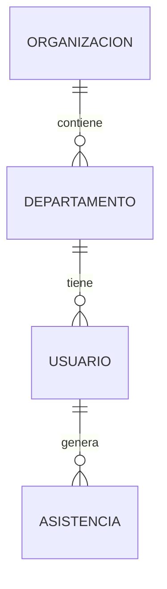

# Planificación de Estructura de Datos y Negocio - MediScan AI

Este documento detalla la evolución del modelo de datos y la arquitectura para transformar la aplicación en una herramienta de gestión hospitalaria profesional.

## 1. El Salto de "Demo Simple" a "Sistema SaaS"

Actualmente la app es lineal: Login -> Crear Usuario -> Escanear -> Log.
Para que sea "WOW", vamos a estructurarla como un sistema **SaaS (Software as a Service)** donde un Admin gestiona una entidad compleja.

### Entidades Propuestas (Modelo Relacional)

| Entidad | Propósito | Atributos Clave |
| :--- | :--- | :--- |
| **Organización** | El Hospital o Clínica | `id`, `nombre`, `owner_id` (del Admin) |
| **Departamento** | Áreas del hospital | `id`, `nombre`, `organización_id` |
| **Usuario (Staff)**| Médicos, enfermeras, etc. | `id`, `nombre`, `rol`, `departamento_id`, `face_encoding` |
| **Asistencia** | El registro de entradas | `id`, `usuario_id`, `timestamp`, `estado`, `temperatura`? |

## 2. Diagrama de Relaciones Sugerido

---

## 3. Patrones de Diseño para el Portafolio

Para que el código no sea solo "pedir cosas por pedir", implementaremos:

### A. Repository Pattern (Capa de Datos)
- **Qué es**: Una clase que se encarga *solo* de hablar con la base de datos.
- **Por qué**: Si el día de mañana cambias de PostgreSQL a otra base de datos, solo tocas el Repository, no toda la App.
- **Ejemplo**: `DepartmentRepository.get_all_by_hospital(hospital_id)`

### B. Service Layer (Capa de Negocio)
- **Qué es**: Una clase que decide *qué pasa* con los datos.
- **Por qué**: Aquí es donde va la lógica pesada. Ejemplo: *"Si un usuario marca entrada pero ya tiene una entrada hoy, no crees otra, lanza una advertencia"*.

---

## 4. Experiencia de la Demo Mejorada

Si alguien entra a tu demo, esto es lo que debería ver para quedar impresionado:

1.  **Dashboard de Bienvenida**: Un resumen visual (ej: "Hoy asistieron 45/50 empleados").
2.  **Gestión de Áreas**: Poder crear "Urgencias", "UCI", "Pediatría".
3.  **Registro de Staff con Contexto**: Al crear un usuario, le asignas su área y su rol (Médico, Recepcionista).
4.  **Simulación de Alertas**: Si el sistema detecta que alguien de "Administración" intentó entrar a una zona de "UCI" (aunque esto es más avanzado, se puede mencionar como plan futuro).

## 5. Próximos Pasos de Planificación

1.  **Definir Schemas (Pydantic)**: Cómo viajan los datos entre FE y BE.
2.  **Definir Endpoints**: Qué rutas necesitamos (ej: `GET /departments`).
3.  **Mockups de Dashboard**: Cómo se verá la información segmentada por área.
